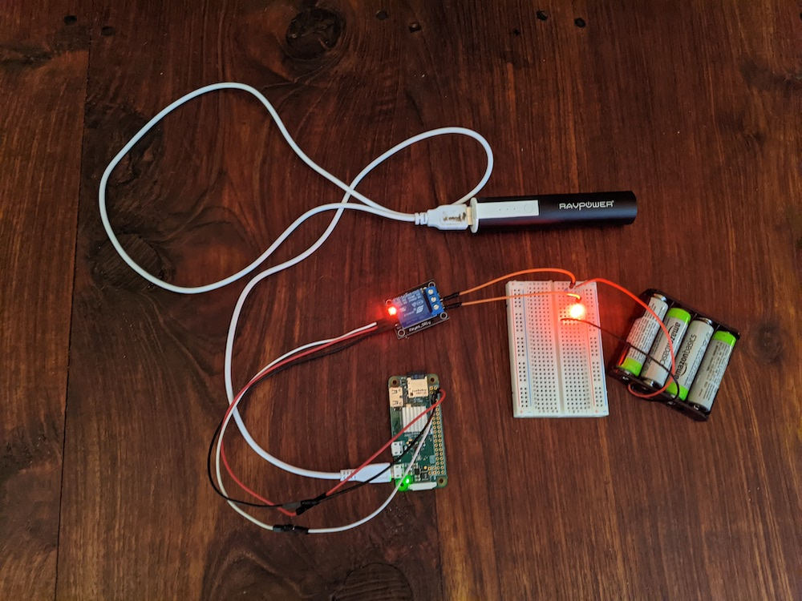

# Project Status

## Monday February 9, 2021

Began assembly of Mark 1 device. Simple platform based on Raspberry Pi Zero.  Initial code to activate relay switch for altermating NMES to legs.

```
#include <wiringPi.h>
#include <stdio.h>
#include <stdlib.h>

#define  RelayPin  7

int main(void){
    if(wiringPiSetup() == -1){ //when initialize wiring failed, print messageto screen
        printf("setup wiringPi failed !");
        exit(1); 
    }
    
    pinMode(RelayPin, OUTPUT);   //set GPIO0 output

    for(;;){
        // disconnect
        printf("|   ...Relay Close   |\n");
        digitalWrite(RelayPin, LOW);
        delay(1000);
        // connect
        printf("|   Relay Open...    |\n");
        digitalWrite(RelayPin, HIGH);
        delay(1000);
    }

    return 0;
}
```

Prerequisites:

```
sudo apt-get install wiringpi
```


Compile:

```
gcc -Wall -o led led.c  -lwiringPi
```



Components:
* Raspberry PI Zero running Raspberry PI OS
* USB power
* 5v relay
* 6v battery
* LED
* 220 Ohm resister

Next steps:

* pressure sensors (2)
* measure/compare relative pressure via sensors with capacitor
* toggle power to direct NMES to leg with greatest heal pressure

